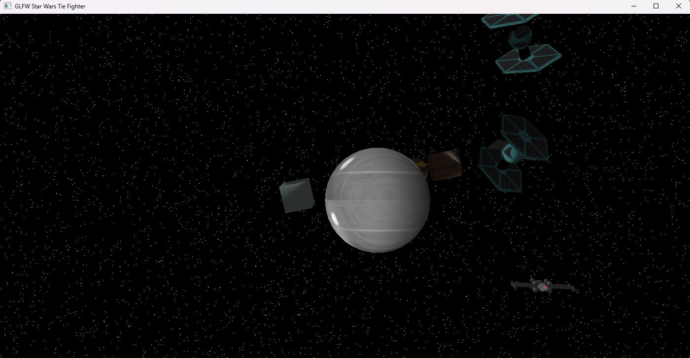
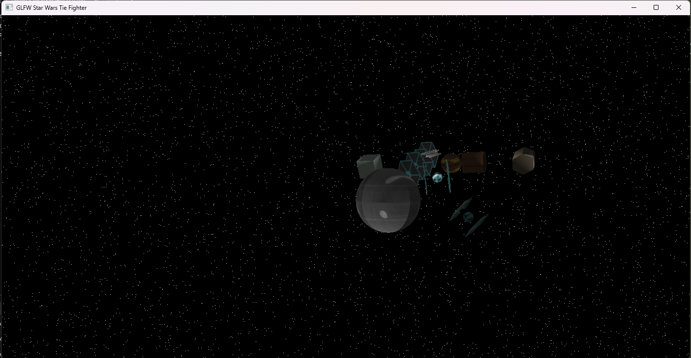
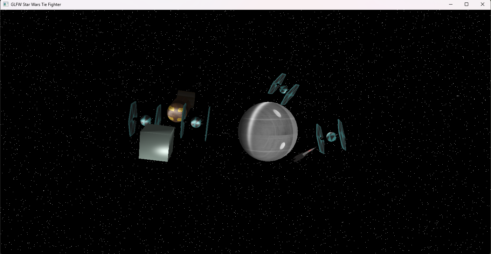

# ✨ Star Wars 3D Phong Illumination

A real-time 3D Star Wars scene renderer with dynamic Phong lighting implementation using OpenGL and GLFW.


## 🎯 Overview

This project implements a fully interactive 3D Star Wars-themed scene featuring TIE Fighters, X-Wings, and the Death Star, with real-time Phong lighting. The lighting system includes ambient, diffuse, and specular components, creating realistic visual effects that respond dynamically to light position changes.

### ✨ Key Features

- 🌟 **Phong Lighting Model**: Full implementation with ambient, diffuse, and specular components
- 🎮 **Interactive Light Control**: Move the light source in real-time across all three axes
- 🚀 **Star Wars Assets**: TIE Fighters, X-Wings, Death Star, and more
- 🌌 **Space Skybox**: Immersive space environment
- 📐 **Normal Vectors**: Properly calculated normals for all 3D objects
- 🎨 **Texture Mapping**: Custom textures for enhanced visual quality
- 👁️ **Free Camera**: Navigate the scene with mouse and keyboard

## 🖼️ Screenshots





## 🛠️ Technologies

- **C++** - Core programming language
- **OpenGL 3.3+** - Graphics API
- **GLFW** - Window and input management
- **GLEW** - OpenGL extension loading
- **GLM** - Mathematics library for graphics
- **GLSL** - Shader programming

## 📋 Requirements

### Windows (Code::Blocks)
- MinGW/GCC compiler
- OpenGL 3.3+ support
- GLFW library
- GLEW library
- GLM headers

### Libraries Included
- GLFW (Graphics framework)
- GLEW (OpenGL extension wrangler)
- GLM (OpenGL Mathematics)
- stb_image (Image loading)

## 🚀 Building and Running

### Using Code::Blocks
1. Open `GLFW_Tie_Fighter.cbp` in Code::Blocks
2. Build the project (F9)
3. Run (Ctrl+F10)

### Using the Build Script
```cmd
cd GLFW_Tie_Fighter
build.bat
```

### Running the Executable
```cmd
run.bat
```

## 🎮 Controls

### Camera Movement
| Key | Action |
|-----|--------|
| `W` | Move forward |
| `S` | Move backward |
| `A` | Move left |
| `D` | Move right |
| `E` | Move up |
| `C` | Move down |
| `SPACE` | Reset camera position |
| `Mouse` | Look around (FPS-style) |

### Light Controls
| Key | Axis | Direction |
|-----|------|-----------|
| `I` | X | Increase (right) |
| `K` | X | Decrease (left) |
| `U` | Y | Increase (up) |
| `J` | Y | Decrease (down) |
| `O` | Z | Increase (forward) |
| `L` | Z | Decrease (backward) |

### System
| Key | Action |
|-----|--------|
| `ESC` | Exit application |

## 🔬 Technical Implementation

### Phong Lighting Components

The lighting system implements the classic Phong reflection model:

#### 1. **Ambient Lighting**
```glsl
vec3 ambient = light.ambient * texColor;
```
Provides base illumination independent of light direction.

#### 2. **Diffuse Lighting**
```glsl
vec3 norm = normalize(Normal);
vec3 lightDir = normalize(light.position - FragPos);
float diff = max(dot(norm, lightDir), 0.0);
vec3 diffuse = light.diffuse * diff * texColor;
```
Illuminates surfaces based on the angle between surface normal and light direction.

#### 3. **Specular Lighting**
```glsl
vec3 viewDir = normalize(viewPos - FragPos);
vec3 reflectDir = reflect(-lightDir, norm);
float spec = pow(max(dot(viewDir, reflectDir), 0.0), material.shininess);
vec3 specular = light.specular * spec * material.specular;
```
Creates highlights based on viewer position and reflection angle.

### Shader Pipeline

**Vertex Shader** (`vertex.glsl`):
- Transforms vertices to world space
- Computes fragment positions for lighting calculations
- Properly transforms normal vectors: `Normal = mat3(transpose(inverse(model))) * aNormal`

**Fragment Shader** (`fragment.glsl`):
- Implements Phong lighting model
- Combines ambient, diffuse, and specular components
- Applies texture mapping

## 📁 Project Structure

```
GLFW_Tie_Fighter/
├── main.cpp              # Main application loop
├── vertex.glsl           # Vertex shader
├── fragment.glsl         # Fragment shader
├── include/              # Header files
│   ├── Shader.h
│   ├── Object.h
│   ├── Cube.h
│   ├── Sphere.h
│   ├── TieFighter.h
│   ├── XWing.h
│   ├── Skybox.h
│   └── ...
├── src/                  # Implementation files
│   ├── Cube.cpp
│   ├── Sphere.cpp
│   ├── TieFighter.cpp
│   └── ...
├── imagens/              # Texture files
└── build.bat             # Build script
```

## 🎓 Academic Context

This project was developed as **Assignment T3** for the Computer Graphics course at **Universidade de Caxias do Sul (UCS)**.

**Course**: Computação Gráfica (FBI4007)  
**Assignment**: Trabalho de Implementação T3  
**Objective**: Implement Phong lighting in a 3D scene using OpenGL

### Requirements Met
- ✅ Normal vectors for all objects
- ✅ Phong lighting (ambient + diffuse + specular)
- ✅ Modified vertex and fragment shaders
- ✅ Point light illuminating all scene objects
- ✅ Keyboard control for light movement (X, Y, Z axes)
- ✅ Visual color variations based on light angles

## 🎨 Assets

- **Textures**: Custom Star Wars themed textures
- **3D Models**: Procedurally generated using geometric primitives
  - TIE Fighter (spheres, cylinders, custom wings)
  - X-Wing (composite object)
  - Death Star (textured sphere)
  - Additional geometric objects (cubes, cylinders, hexagons)

## 🐛 Known Issues

- None reported

## 🔧 Troubleshooting

**Issue**: `glew32.dll` not found  
**Solution**: Ensure `run.bat` is used, or copy `glew32.dll` to the same directory as the executable

**Issue**: Black screen on startup  
**Solution**: Make sure your graphics card supports OpenGL 3.3+

**Issue**: Textures not loading  
**Solution**: Verify `imagens/` folder is in the same directory as the executable

## 📝 License

This project is licensed under the MIT License - see below for details:

```
MIT License

Copyright (c) 2025 Rafael BS

Permission is hereby granted, free of charge, to any person obtaining a copy
of this software and associated documentation files (the "Software"), to deal
in the Software without restriction, including without limitation the rights
to use, copy, modify, merge, publish, distribute, sublicense, and/or sell
copies of the Software, and to permit persons to whom the Software is
furnished to do so, subject to the following conditions:

The above copyright notice and this permission notice shall be included in all
copies or substantial portions of the Software.

THE SOFTWARE IS PROVIDED "AS IS", WITHOUT WARRANTY OF ANY KIND, EXPRESS OR
IMPLIED, INCLUDING BUT NOT LIMITED TO THE WARRANTIES OF MERCHANTABILITY,
FITNESS FOR A PARTICULAR PURPOSE AND NONINFRINGEMENT. IN NO EVENT SHALL THE
AUTHORS OR COPYRIGHT HOLDERS BE LIABLE FOR ANY CLAIM, DAMAGES OR OTHER
LIABILITY, WHETHER IN AN ACTION OF CONTRACT, TORT OR OTHERWISE, ARISING FROM,
OUT OF OR IN CONNECTION WITH THE SOFTWARE OR THE USE OR OTHER DEALINGS IN THE
SOFTWARE.
```

## 👤 Author

**Rafael BS**  
GitHub: [@RafaelBSberse](https://github.com/RafaelBSberse)

## 🙏 Acknowledgments

- Professor Alexandre E. Krohn Nascimento (UCS)
- OpenGL community and documentation
- LearnOpenGL tutorials for shader implementation guidance
- Star Wars franchise for inspiration

## 📚 References

- [LearnOpenGL - Lighting](https://learnopengl.com/Lighting/Basic-Lighting)
- [OpenGL Documentation](https://www.opengl.org/documentation/)
- [GLFW Documentation](https://www.glfw.org/documentation.html)
- Phong, B. T. (1975). "Illumination for Computer Generated Pictures"

---

⭐ **If you found this project helpful, please consider giving it a star!**
